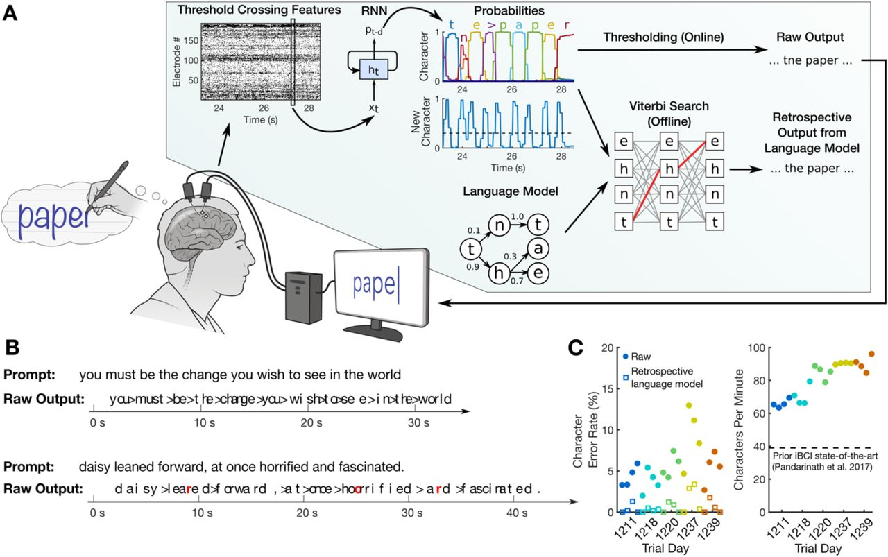

# Neural Decoding for Handwriting: A Case Study

## Introduction

In recent years, advances in neural decoding techniques have shown promise in restoring communication and motor function in individuals with severe neurological impairments. In this study, we present a case study of neural decoding applied to handwriting tasks in a patient (T5) with a spinal cord injury. Our aim is to demonstrate the feasibility and potential clinical utility of neural interfaces for individuals with motor disabilities.

## Participant Information

**Test Person (T5):**  
- Right-handed male, 65 years old at the time of data collection
- Sustained a C4 AIS C spinal cord injury approximately 9 years prior to study enrollment

## Experimental Setup

### Neural Signal Recording
- **Electrode Arrays:** Two 96 electrode intracortical arrays (Neuroport arrays) placed in the hand “knob” area of T5’s left-hemisphere precentral gyrus.
- **Signal Processing:** Analog filtering from 0.3 Hz to 7.5 kHz, digitization at 30 kHz, common average reference filtering, and digital bandpass filtering from 250 to 3000 Hz.

### Task Paradigm
- **Session Structure:** 3-5 hour sessions, 2-3 times per week, with uninterrupted blocks of 5-10 minutes.
- **Tasks:** Employed an instructed delay paradigm, with sentence writing blocks and rest periods.

### Experiment Setup
- **Prompting:** Computer monitor displaying sentences or characters to write.
- **Cueing:** Transition from reading to writing signaled by a green cue after a delay period.

## Neural Decoding Methods

### Data Analysis
- **Principal Components Analysis (PCA):** Reduced neural activity to top 3 dimensions.
- **Time-Aligned Analysis:** Removal of temporal variability for consistent neural patterns.
- **t-Distributed Stochastic Neighbor Embedding (t-SNE):** Nonlinear dimensionality reduction for visualization.

### Linear Decoder
- **Training:** Linear decoding of pen tip velocity from neural activity.
- **Decoder Structure:** Computed velocity based on threshold crossing rates and hand-made templates.

### Recurrent Neural Network (RNN) Decoder
- **Architecture:** Two-layer gated recurrent unit (GRU) RNN trained with an output delay.
- **Preprocessing:** Binning, z-scoring, smoothing, and concatenation of threshold crossing rates.

### Data Labeling
- **Challenge:** Unknown character labeling addressed using forced-alignment or unsupervised inference techniques.

## Performance Evaluation

### Metrics
- **Character Error Rate:** Edit distance between decoded sentence and prompt.

### Real-Time Evaluation
- **Continuous Training:** RNN retraining with new data on each session.

## Language Model Integration

### Retrospective Analysis
- **Custom Language Model:** Autocorrection of decoding errors for improved accuracy.

## Conclusion

This case study demonstrates the application of neural decoding techniques to handwriting tasks in a patient with a spinal cord injury. The results highlight the potential of neural interfaces for restoring communication and motor function in individuals with severe neurological impairments.

## References
- Original Paper: [Nature Article](https://www.nature.com/articles/s41586-021-03506-2)

